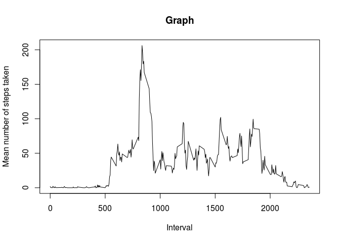
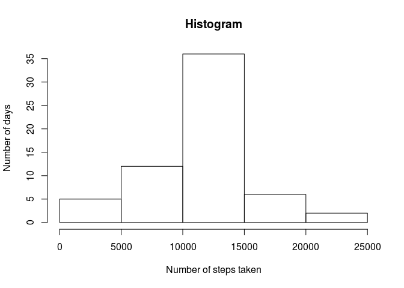
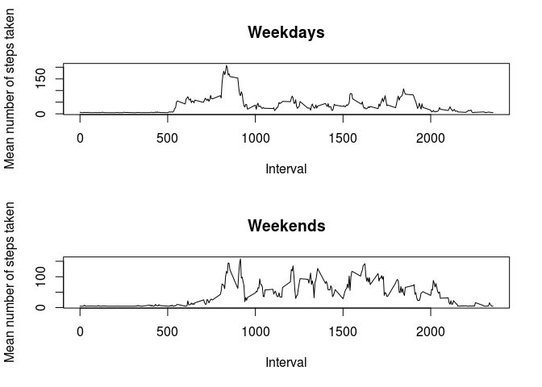

# Reproducible Research: Peer Assessment 1

## Loading and preprocessing the data
Firs we will load the file with the date field as a factor of characters


```r
arq = read.csv("activity.csv", header= TRUE, sep=",")
```

## What is mean total number of steps taken per day?
We will need to sum the number of steps taken each day first and makke an histogram with the resulting vector


```r
arq2 = tapply(arq$steps, arq$date, sum)
hist(arq2, xlab="Number of steps taken", main="Histogram", ylab="Number of days")
```

 

Calculate the mean and sd


```r
med=mean(arq2, na.rm=TRUE)
desvio=sd(arq2, na.rm=TRUE)
```
Mean is 
1.0766189\times 10^{4} 

and sd is
4269.1804927

## What is the average daily activity pattern?
Doing the same procceding that wass done last time, but now considering the interval as the factor:


```r
new = arq[complete.cases(arq), ]
arq3 = tapply(new$steps, new$interval, mean)
interval=names(tapply(new$steps, new$interval, mean))
plot(interval, arq3,type="l", xlab="Interval", main="Graph", ylab="Mean number of steps taken")
```

 

Finding the interval that contains the maximum number of steps


```r
arq4=data.frame(arq3, interval)
ordered = arq4[order(-arq3),]
```
The interval that contains, in average, the maximum number of steps is 
835

## Imputing missing values
Calculating the number of missing values


```r
NAs=nrow(arq)-nrow(new)
```

Number of rows with NA is 2304

Filling the NAs with the mean for that day
Unfortunatelly, there are days in witch all measurements are NA, in those days, we will use the mean of the period


```r
arq5 = tapply(arq$steps, arq$date, sum)
med= mean(arq5, na.rm = TRUE)
arq5[is.na(arq5)]=med
arq1=arq
for (i in 1:17568)
{
    if (is.na(arq1$steps[i]))
    {
        arq1$steps[i]=arq5[arq1$date[i]]/288       
    }
}
```

Making the histogram


```r
arq6 = tapply(arq1$steps, arq1$date, sum)
hist(arq6, xlab="Number of steps taken", main="Histogram", ylab="Number of days")
```

 

```r
new_med=median(arq6)
new_sd=sd(arq6)
```

The new median is:
1.0766189\times 10^{4}

The new SD is:
3974.390746

## Are there differences in activity patterns between weekdays and weekends?

Transform the date as character to date and generate a vector of weekday/weekends


```r
data=as.Date(arq1$date)
day=weekdays(data)
day[(day=="sábado" | day=="domingo")]="weekend"
day[day!="weekend"]="weekday"
arq1=cbind(arq1, day)
```

Plot the graph


```r
par(mfcol=c(2,1))

week_days=arq1[arq1$day=="weekday", ]
week_ends=arq1[arq1$day=="weekend", ]

string_days = tapply(week_days$steps, week_days$interval, mean)
interval_1=names(tapply(week_days$steps, week_days$interval, mean))

string_ends = tapply(week_ends$steps, week_ends$interval, mean)
interval_2=names(tapply(week_ends$steps, week_ends$interval, mean))

plot(interval_1, string_days,type="l", xlab="Interval", main="Weekdays", ylab="Mean number of steps taken")
plot(interval_2, string_ends,type="l", xlab="Interval", main="Weekends", ylab="Mean number of steps taken")
```

 
